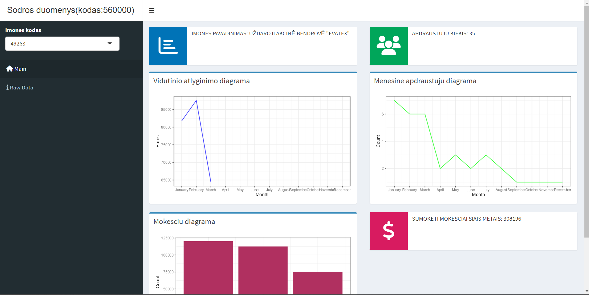

# R Laboratorinis darbas: duomenų vizualizacija

| Variantas | ecoActCode |
|------------- | ------------- |
|18   | 560000      |

### 1. Užduotis

Atsakymas:

Išvados: Atfiltravus duomenis pagal duotą ekonominės veiklos kodą, maitinimo ir gėrimų teikimo veiklos įmonėse minimalus atlyginimas yra 300 eurai, vidutinis atlyginimas yra 90017 eurai, dižiausias atlyginimas yra 4795893 eurai.

### 2. Užduotis

Atsakymas:

Išvados: Penkios maitinimo ir gėrimų teikimo veiklos įmonės, kurių vidutinis atlyginimas buvo didžiausias: LABDAROS IR PARAMOS FONDAS NEMUNO KRAŠTO VAIKAI, UAB TEKILOS NAMAI,	
UAB RESTORANAS SIESTA, UAB SESERŲ BISTRO, UAB "3B SOLUTIONS". 
Palyginus visų įmonių pirmąjį pusmetį su antruoju, galima pastebėti, jog antroje metų pusėje išaugo. Stabiliausius atlyginimus turėjo UAB "3D SOLUTIONS", o labiausiai atlygimai keitėsi įmonėje LABDAROS IR PARAMOS FONDAS NEMUNO KRAŠTO VAIKAI. Daugelio įmonių iššoko liepos mėnesį, tačiau tolimesniuose mėnesiuose jie vėl nukrito. 

### 3. Užduotis

Atsakymas:

Išvados: Tose pačiose įmonėse apdraustųjų skaičius taip pat ganėtinai skiriasi. Daugiausiai apdraustųjų turėjo UAB "3B SOLUTIONS": 394 darbuotojus, o mažiausiai tarp šių įmonių turėjo UAB SESERŲ BISTRO: 88 darbuotojus. Reikėtų pastebėti, jog tarp UAB SESERŲ BISTRO ir UAB TEKILOS NAMAI bei UAB "3B SOLUTIONS" ir LABDAROS IR PARAMOS FONDAS NEMUNO KRAŠTO VAIKAI yra didelis šuolis tarp apdraustųjų skaičiaus šiose įmonėse. 

### 4. Užduotis

Shiny R aplikacijos nuotrauka:

